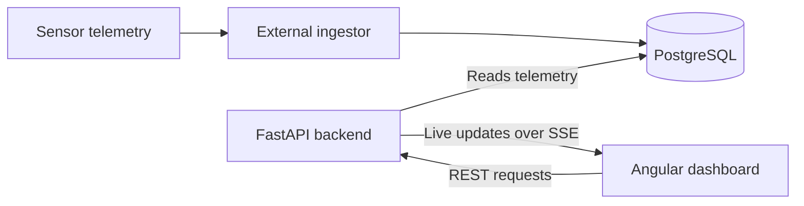

# Room Monitoring

A web dashboard and API for monitoring indoor conditions, air quality, and sensor
health. Built around telemetry from a BME680 sensor setup, it shows current
readings and lets you explore how measurements change over time.

The project uses Angular, Angular Material, and ApexCharts for the interface,
with a FastAPI backend that reads from PostgreSQL. It is developed on a PC and
intended to join the existing room-monitoring deployment on an NVIDIA Jetson.

## What it does

### Live monitoring

- Displays temperature, humidity, pressure, gas resistance, IAQ, static IAQ,
  estimated CO₂ and breath VOC equivalents, and gas percentage.
- Shows sensor diagnostics: IAQ accuracy, stabilization, run-in completion,
  sensor status, and heartbeat.
- Uses gauges and value-range indicators to make readings easier to interpret.
  Telemetry quality—Good, Uncertain, or Bad—is shown separately from the
  interpretation of the measured value.
- Updates readings independently as each tag changes, with observation ages and
  detailed timestamps. Keeps last-known values visible when the connection drops.

### History and comparisons

- Select one or several measurements and a 1-hour, 6-hour, 24-hour, or custom
  time range. Filter changes take effect when you click **Apply**.
- Explore ApexCharts with zoom, pan, and a starting window of about 100 readings.
  Hover horizontally across the plot to inspect nearby observations without
  having to hit an individual point.
- Compare measurements with different units on a labeled relative scale, while
  retaining actual values, units, quality, and individual timestamps in hover details.
- Switch to a paginated readings table or load more history using cursor pagination.
  The interface loads up to 5,000 readings per query across the selected measurements.
- Displays dates and times in **Asia/Taipei**.

The Live and History pages use responsive layouts that fit the viewport.
A CCTV demo page also exists with a disconnected feed, mock controls, and mock
person-recognition information. Its navigation tab is currently disabled;
camera streaming and recognition are not implemented.

## How it fits together



This repository contains the dashboard and API. The ingestor and PostgreSQL
deployment are managed separately. The API expects the existing `tags` and
`telemetry_readings` tables to be populated by the ingestor.

Live updates use Server-Sent Events (SSE). One polling task per backend process
reads the latest observations, waiting five seconds between polls, and shares
updates with connected clients. History requests read PostgreSQL directly.

## Run with Docker Compose

Requires Docker Compose and access to the existing PostgreSQL database.

1. Create the backend configuration if it does not already exist:

   ```bash
   cp -n backend/.env.example backend/.env
   ```

2. Edit `backend/.env` with the database hostname or IP, port, database name,
   username, and password. The database address must be reachable from the
   backend container. Keep `TIMEZONE=Asia/Taipei`.

3. Start the frontend and backend from the repository root:

   ```bash
   docker compose up -d --build --wait
   ```

Open `http://<host-name-or-ip>:8080` for the dashboard or
`http://<host-name-or-ip>:8000/docs` for the interactive API documentation.
Replace the placeholder with the development PC's reachable hostname or LAN IP.

Nginx serves the frontend and proxies `/api` requests and SSE connections to
`backend:8000` on the Compose network. The included Compose file runs the
frontend and backend; it connects to your existing database.

## Repository guide

| Location | Purpose |
| --- | --- |
| [`frontend/`](frontend/) | Angular dashboard, Material components, and ApexCharts history views. |
| [`backend/`](backend/) | FastAPI endpoints for tag metadata, latest readings, history, and live events. |
| [`compose.yaml`](compose.yaml) | Builds and runs the frontend and backend together. |

See the [frontend guide](frontend/README.md) for local Angular development,
chart behavior, and verification commands. The [backend guide](backend/README.md)
covers API development, SSE behavior, and adding both services to the existing
`room-monitoring-deployment/compose.yaml` on the Jetson.
